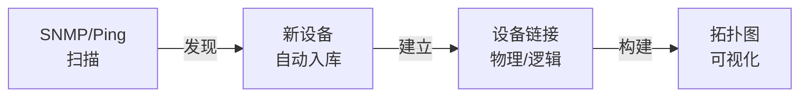
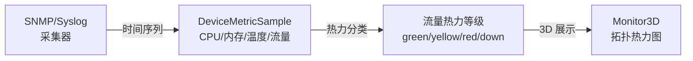
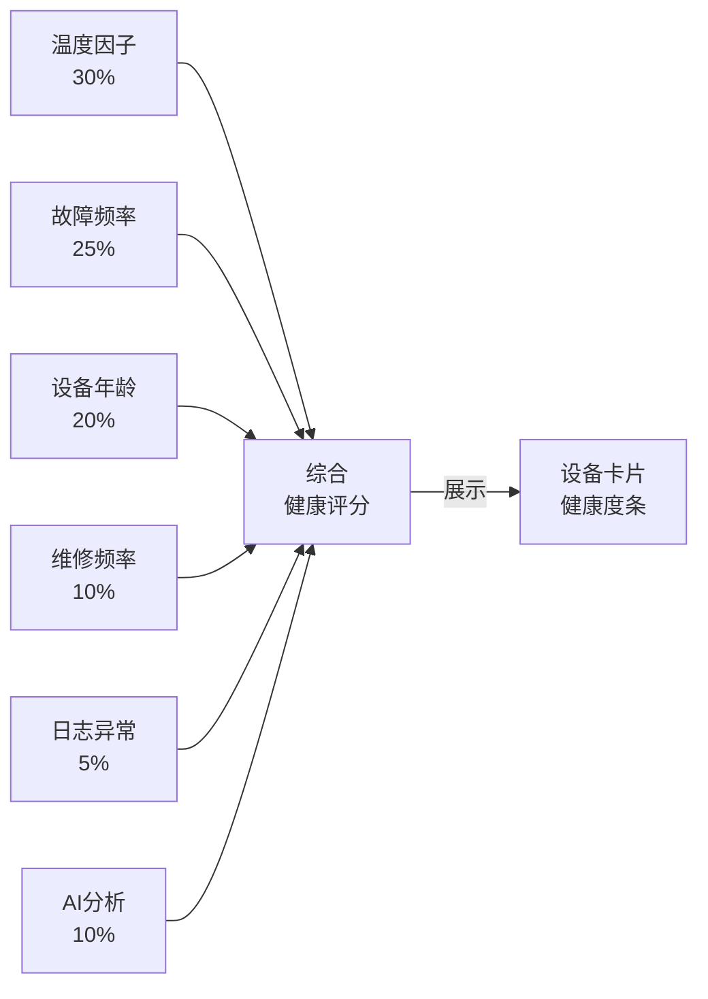
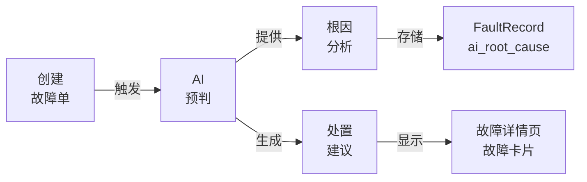
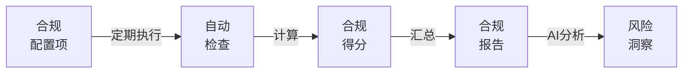
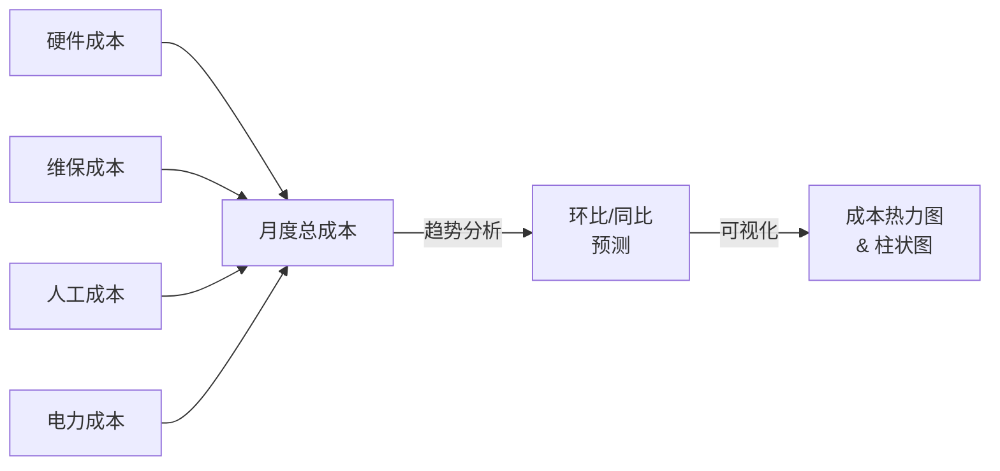
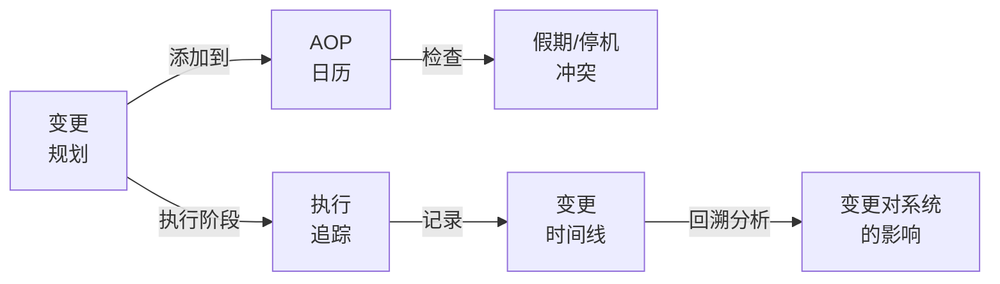
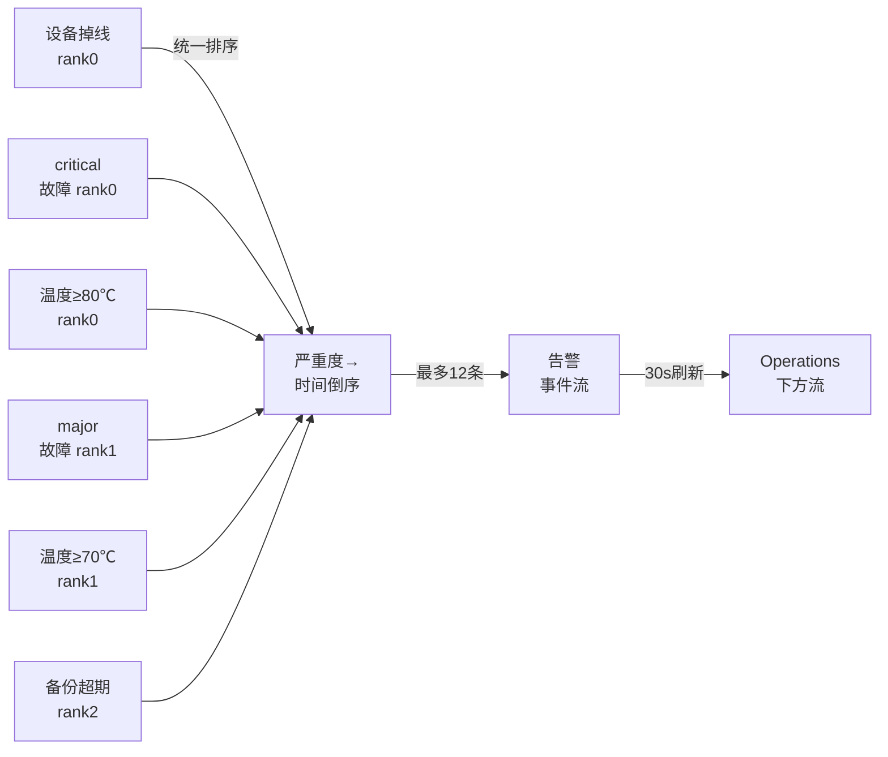
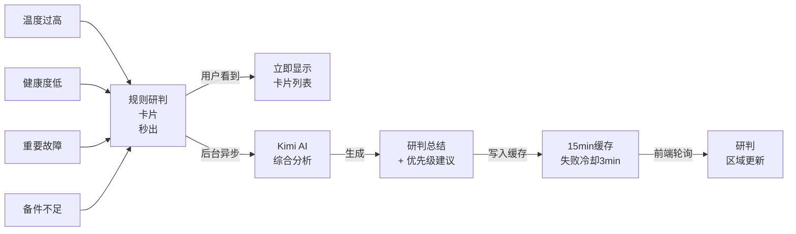
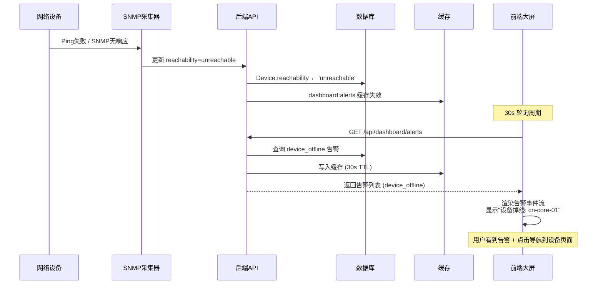

# 数字网络运维管理系统 - 系统架构图

## 整体架构


---

## 分层详解

### 1️⃣ **前端层** (Vue 3 + Element Plus + ECharts)
| 页面 | 功能 | 关键组件 |
|------|------|--------|
| **Dashboard** | 领导层经营摘要 + KPI 统计卡 | 可用率、故障数、成本趋势、MTTR 漏斗 |
| **Operations** | 运维值班主管大屏 | 告警事件流、AI 研判、故障趋势图、成本热力 |
| **Devices** | 设备清单 + 分组管理 | 设备树、部署状态、可达性、可用率 |
| **Faults** | 故障单全生命周期 | 故障创建、AI 预判、根因分析、处置记录 |
| **Monitor3D** | 3D 拓扑网络图 | 实时流量热力、设备可达性状态、关联图 |
| **Compliance** | 合规性检查 + AI 配置 | 检查项状态、AI 模型配置、备份覆盖率 |
| **AOP** | 变更规划与执行 | 变更日历、执行追踪、回溯分析 |
| **Backups** | 备份策略 + 恢复 | 备份记录、恢复时间、覆盖统计 |
| **Reports** | 多维度报表 | 月度汇总、趋势对比、合规报告 |

---

### 2️⃣ **API 路由层** (FastAPI)
```
/api/dashboard/
  ├─ /summary              → 仪表板摘要 (30s缓存)
  ├─ /ai-summary           → 领导层 AI 摘要 (后台生成)
  ├─ /executive-summary    → KPI 统计卡 (30s缓存，30s自动刷新)
  ├─ /realtime-status      → 实时基础设施状态 (15s缓存)
  ├─ /alerts               → 告警事件流 (30s缓存，30s自动刷新)
  ├─ /top-fault-devices    → 故障频繁设备排行
  ├─ /fault-trend          → 故障趋势图表
  └─ /cost-trend           → 成本趋势分析

/api/devices/
  ├─ GET  /               → 设备列表 (分页、过滤)
  ├─ GET  /{id}           → 设备详情 + 健康评分
  ├─ POST /               → 新增设备
  ├─ PUT  /{id}           → 更新设备
  └─ /discovery           → 设备发现任务

/api/faults/
  ├─ GET  /               → 故障单列表
  ├─ POST /               → 创建故障单 (自动触发 AI 预判)
  ├─ GET  /{id}           → 故障详情
  ├─ POST /{id}/ai-pre-diagnose → 触发 AI 根因分析
  └─ POST /{id}/assign    → 分派处置

/api/ai/
  ├─ /briefing            → 运营研判 (规则卡 + AI 合成)
  ├─ /recommendations     → 处置建议卡片
  └─ /config/test         → 测试 AI 配置

/api/health/
  ├─ /{device_id}/score   → 设备健康评分
  └─ /{device_id}/details → 评分因子分解

/api/monitor/
  ├─ /heat-map            → 流量热力图
  └─ /device-reachability → 设备可达性矩阵

/api/backups/
  ├─ /coverage            → 备份覆盖率统计
  └─ /records             → 备份记录列表

/api/compliance/
  ├─ /checks              → 合规检查项
  ├─ /ai-config           → AI 模型配置 (CRUD)
  └─ /ai-config/test      → 配置测试

/api/aop/
  ├─ /plans               → 变更规划
  ├─ /executions          → 变更执行记录
  └─ /calendar            → 假期/停机日历

```

---

### 3️⃣ **服务层** (业务逻辑)
| 服务 | 职责 | 关键方法 |
|------|------|--------|
| **DashboardService** | KPI 聚合、统计卡生成 | `get_executive_summary()`, `get_alerts()`, `get_fault_trend()` |
| **DeviceService** | 设备生命周期管理 | `create_device()`, `update_reachability()`, `get_device_health()` |
| **HealthCalculator** | 设备健康评分算法 | `_calculate_temperature_score()`, `_calculate_health_score()` |
| **FaultService** | 故障单 CRUD + AI 触发 | `create_fault()`, `trigger_ai_prediagnose()` |
| **AITriageService** | AI 研判 + 建议生成 | `pre_diagnose_fault()`, `generate_operational_briefing()`, `generate_executive_narrative()` |
| **BackupService** | 备份策略执行 | `calculate_coverage()`, `list_backup_records()` |
| **ComplianceService** | 合规检查 | `run_compliance_check()`, `get_compliance_score()` |
| **Monitor3DService** | 拓扑热力图 | `classify_traffic_heat()`, `build_device_reachability_matrix()` |
| **NotificationService** | 告警触达 | `send_alert()`, `notify_fault_created()` |
| **EmailService** | 邮件发送 | `send_email()`, `send_scheduled_reports()` |

---

### 4️⃣ **数据层** (缓存 + 数据库)
**缓存策略** (app/shared/cache.py SimpleCache):
- `dashboard:summary` → 30s
- `dashboard:ai-summary` → 900s (失败冷却 180s)
- `ai:briefing` → 900s (失败冷却 180s)
- `dashboard:realtime-status` → 15s
- `dashboard:alerts` → 30s
- `dashboard:cost-trend` → 60s

**数据库** (SQLAlchemy 2.0):
- 开发环境：SQLite (数据/nas.db)
- 生产环境：PostgreSQL + pgvector(向量搜索) + PostGIS(地理信息)
- 迁移管理：Alembic (migrations/ 版本控制)

**数据模型** (app/shared/models.py):
- Device, DeviceMetricSample, DeviceLink, TopologyGraph
- FaultRecord, FaultTimeline, FaultAiAnalysis
- BackupRecord, BackupPolicy, ComplianceCheck
- Cost, SparePartMovement, SparePart, MaintenanceRecord
- SystemConfig, ServiceSlo, AopPlan, AopExecution

---

### 5️⃣ **核心功能模块**

#### 🔍 **设备发现 & 拓扑**


#### ⚡ **实时监控 & 热力**


#### 💊 **设备健康评分**


#### 🔬 **故障预判 & 根因**


#### ✓ **合规性检查**


#### 💰 **成本分析 & 趋势**


#### 📅 **AOP 规划与执行**


#### 🚨 **告警事件流**


#### 📊 **AI 研判 & 建议**


---

### 6️⃣ **外部集成**

#### 🤖 **AI 集成** (Kimi Code API)
```
配置 (Compliance.vue):
  ├─ Provider: anthropic
  ├─ Base URL: https://api.kimi.com/coding
  ├─ Model: kimi-for-coding
  └─ API Key: (用户设置)

使用场景:
  ├─ 故障根因分析 → pre_diagnose_fault()
  ├─ 运营研判生成 → generate_operational_briefing()
  └─ 领导层经营摘要 → generate_executive_narrative()
```

#### 📧 **邮件服务** (SMTP)
```
配置 (SystemConfig):
  ├─ SMTP Host / Port
  ├─ 发件人地址
  └─ 密码

触发场景:
  ├─ 故障创建 → 管理员通知
  ├─ 定时报表 → 领导层摘要
  └─ 合规审计 → 检查报告
```

#### 🔌 **Netmiko 设备交互**
```
用途:
  ├─ 命令下发 (配置备份、重启)
  ├─ 配置获取
  └─ 状态查询

集成点:
  ├─ DeviceService.execute_command()
  ├─ BackupService.backup_device_config()
  └─ ComplianceService.run_compliance_check()
```

#### 📡 **SNMP/Syslog 采集**
```
数据流向:
  SNMP Agent / Syslog
    ↓
  采集器 (可选: 独立服务)
    ↓
  DeviceMetricSample 入库
    ↓
  HealthCalculator 计算评分
    ↓
  Dashboard / Monitor3D 展示
```

#### ⏱️ **Celery 后台任务队列**
```
任务类型:
  ├─ refresh_briefing_cache() → AI 研判后台生成
  ├─ refresh_executive_summary_cache() → 领导摘要后台生成
  ├─ trigger_fault_ai_prediagnosis() → 故障创建时 AI 预判
  ├─ send_scheduled_reports() → 定时报表邮寄
  └─ backup_device_config() → 定时备份执行
```

---

### 7️⃣ **数据流示例：设备离线 → 告警 → 处置**



---

### 8️⃣ **性能优化** ⚡

| 优化策略 | 实现 |
|---------|------|
| **多层缓存** | 规则卡片秒出，AI 后台生成，15min 缓存 |
| **自动刷新** | Dashboard KPI + Operations 告警流 30s 轮询，避免手动刷新 |
| **AI 冷却** | 失败/空结果时也缓存，180s 内不重复触发 |
| **后台异步** | Celery 队列处理 AI 调用、邮件发送、长流程任务 |
| **查询优化** | 关键路径添加索引、分页查询、预加载关联对象 |
| **短缓存** | 实时状态 15s，趋势图 60s，降低 DB 压力 |

---

### 9️⃣ **部署拓扑**

```
┌─────────────────────────────────────────┐
│           用户浏览器 / 移动端             │
└──────────────────┬──────────────────────┘
                   │ HTTPS
    ┌──────────────┴──────────────┐
    │     Nginx / LB (可选)       │
    └──────────────┬──────────────┘
                   │
┌──────────────────┴──────────────────────┐
│        FastAPI 后端 (单进程/Uvicorn)    │
│  • 前端资源服务                        │
│  • REST API 路由                       │
│  • 业务逻辑执行                        │
└──────────────────┬──────────────────────┘
         ┌─────────┼─────────┐
         │         │         │
    ┌────▼──┐ ┌───▼──┐ ┌────▼──┐
    │ 缓存  │ │ 数据库 │ │Celery │
    │Cache  │ │ SQLite/│ │Worker │
    └───────┘ │ PostgreSQL│ └───────┘
              └────────┘

前端打包：Vue 3 + Vite → static/ 由后端提供
集成场景：SNMP trap / Syslog → 可接入 webhook
扩展方向：多后端 + 消息队列(如需)
```

---

## 📋 核心 KPI 指标

```
仪表板展示:
├─ 系统可用率        → device.reachability == 'reachable' / total
├─ 活跃故障数        → status IN (open, assigned, ...) count
├─ MTTR (平均修复时间) → 高危故障从创建到闭环的时间
├─ 备份覆盖率        → backed_up_device / total_in_use
├─ 合规得分          → 检查项通过率 (%)
├─ 月度成本          → hardware + maintenance + labor + energy
└─ 故障趋势          → 过去 30 日每日故障数 (柱状 + 趋势线)

运维总览展示:
├─ 告警事件流        → 最新 12 条告警 (设备掉线/故障/温度/备份)
├─ AI 研判卡片      → 5-8 条规则研判 + AI 合成总结
├─ 故障频繁设备      → Top 5 设备按 30 日故障数排序
├─ 成本热力          → 6 月成本趋势 + 部分/全额对比
└─ 设备健康          → 可达性 + 健康评分 + 主要风险因子
```

---

## 🎯 系统优势总结

✅ **一站式运维** - 发现、监控、故障、合规、成本全覆盖  
✅ **AI 驱动** - 故障预判 + 运营建议 + 领导摘要  
✅ **实时可视化** - 3D 拓扑 + 告警流 + 30s 自动刷新  
✅ **成本透明** - 多维度成本追踪 + 趋势预测  
✅ **变更管理** - AOP 规划 + 执行追踪 + 影响分析  
✅ **合规无忧** - 自动检查 + AI 洞察 + 审计报告  
✅ **低延迟** - 多层缓存 + 后台异步 + 30s 轮询足以

---

